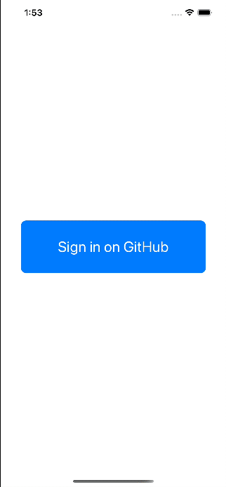
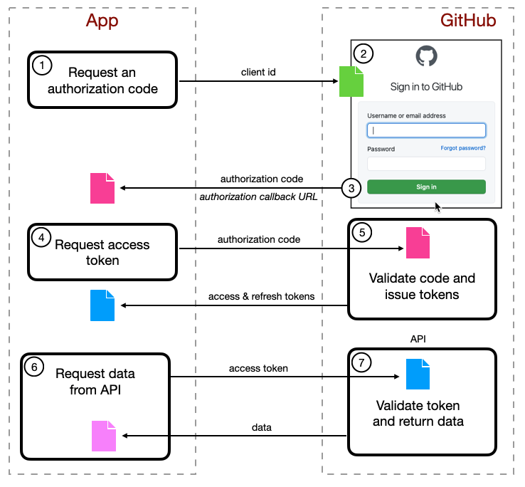
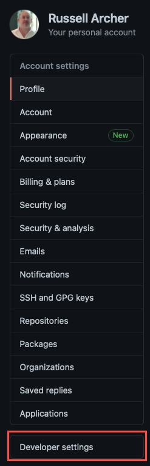
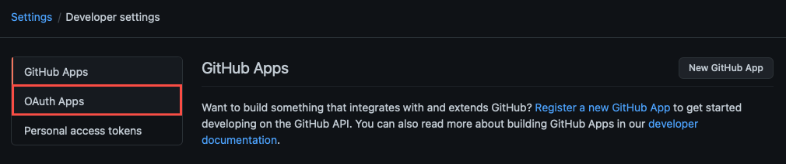
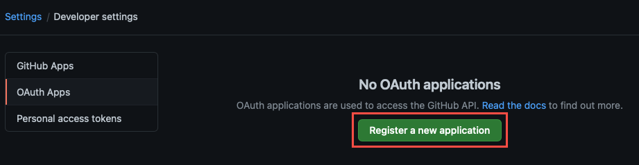
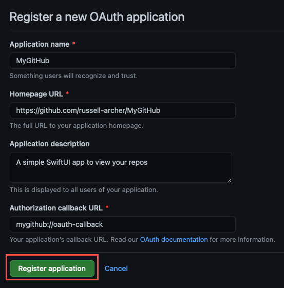
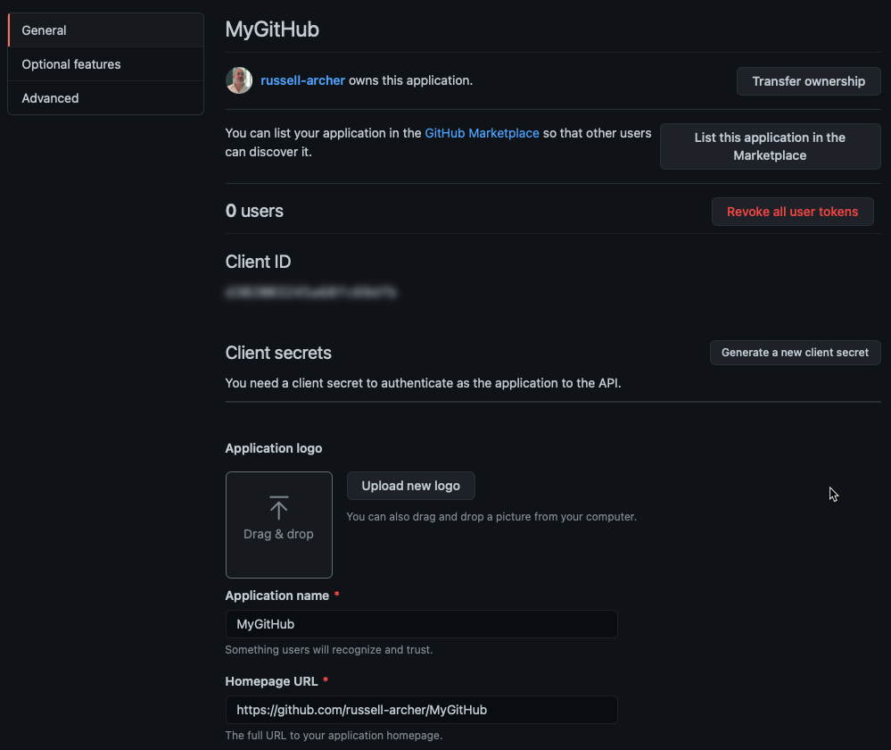
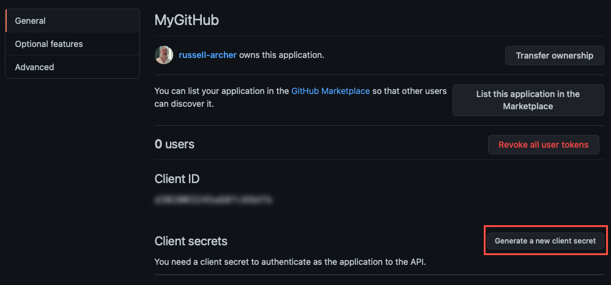
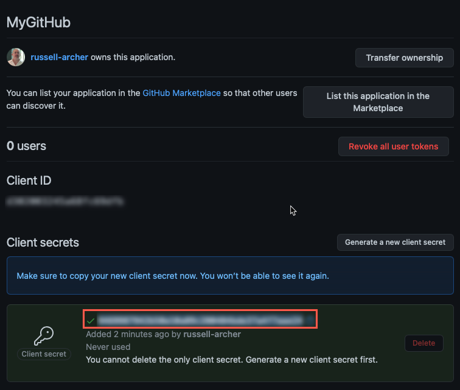

# MyGitHub App

A simple SwiftUI app that uses OAuth2 to authenticate a user on GitHub and allows viewing of the user's repos and profile.

# References

https://docs.github.com/en/rest

# Overview

The **MyGitHub** app needs to be able to read a user's collection of GitHub repositories via the GitHub API. To enable this, the app must allow the user to authenticate 
themselves on GitHub and grant the app "delegated access". This permits the app to request GitHub actions on behalf of the user. GitHub calls this type of app an **OAuth App**.

However, from a GitHub and user perspective, there's a security issue. How does GitHub permit a user to authenticate themselves (and thereby the MyGitHub app) but
prevent the app from having full access to the user's credentials? The answer lies in the use of the OAuth 2.0 framework:

> “The OAuth 2.0 authorization framework enables a third-party app to obtain limited access to an HTTP service, either on behalf of a resource owner by orchestrating an approval interaction between the resource owner and the HTTP service, or by allowing the third-party app to obtain access on its own behalf.”

Using OAuth 2.0 means that the authentication process is handled by the service provider (GitHub in this case). Our app does not directly handle or store user credentials, instead
GitHub provides us with an `access token` that can be used when accessing API services. This token can have an expiration time and can limit the range of services that can be requested.

# OAuth2 Authentication Flow

Here is the flow for the GitHub OAuth2 authentication process:

- The developer of the app defines an `OAuth App` configuration on their GitHub account. This includes providing a `callback URL` for the app
- The app requests an `authorization code` from GitHub. The app's `client ID` (defined as part of the OAuth app configuration) is provided as input
- A web-based GitHub login page is presented and the user enters their credentials
- GitHub authenticates the user and returns an `authorization code` to the app's `callback URL`
- The app requests an `access token` from GitHub. The `authorization code` is provided as input
- GitHub authenticates the request and returns an `access token` and a `refresh token`
- The app makes a request to the GitHub API passing the `access token`. GitHub validates the token and returns the requested data
- When the app's access token expires GitHub returns an invalid token error. The app uses the `refresh token` to request a new access token
- GitHub returns a new `access token` for the app
- When the `refresh token` expires the app must re-start the authentication flow by requesting an `authorization code`

See https://docs.github.com/en/developers/apps/authorizing-oauth-apps.

---

# Defining an OAuth App in GitHub

Sign in to your GitHub account and select **Developer settings**:

Select **OAuth Apps**:

Click **Register a new application**:

Provide the required details then click **Register application**:
- **Application name**
"MyGitHub" in this case

- **Homepage URL**
In a production app this would the app's dedicated website 

- **Application description**
A short description for the app that the user will see

- **Authorization callback URL**
Enter `mygithub://oauth-callback`.
This is the URL that GitHub will redirect the user back to when authentication is complete. Here we define a **custom URL scheme** that will "deep-link" back to our app. 
We'll use Apple's `ASWebAuthenticationSession` to pass our Client ID (which identifies this app), client secret and callback URL scheme to GitHub. A GitHub authentication page is presented to allow the user to authenticate. Once authenticated, GitHub passes back an authorization code to us, using authorization callback URL

GitHub creates the new OAuth app configuration:

Click **Generate a new client secret**:

Copy the generated **client secret** and store it somewhere safely:

This completes the necessary GitHub configuration. 
